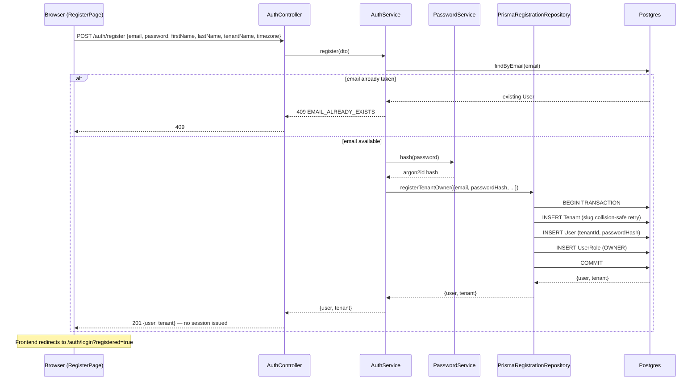
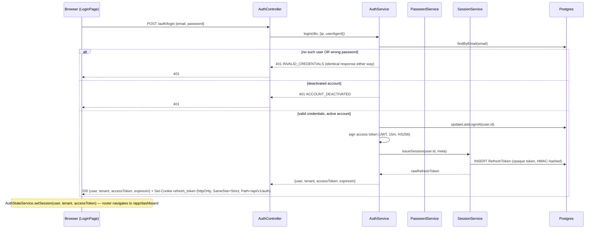
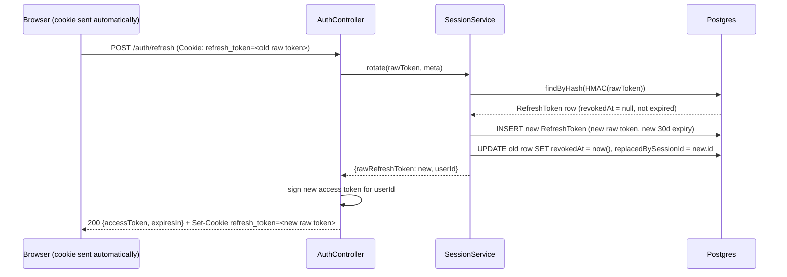
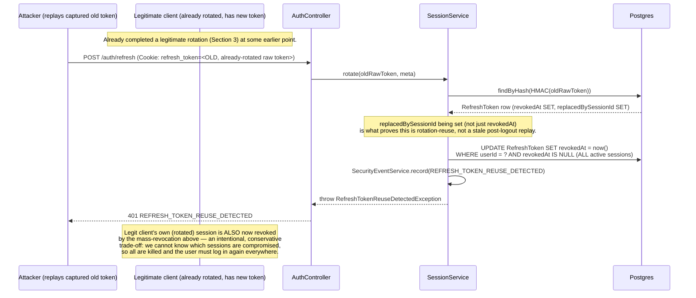
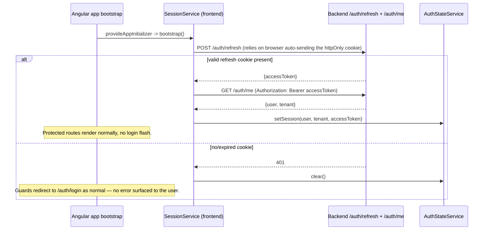
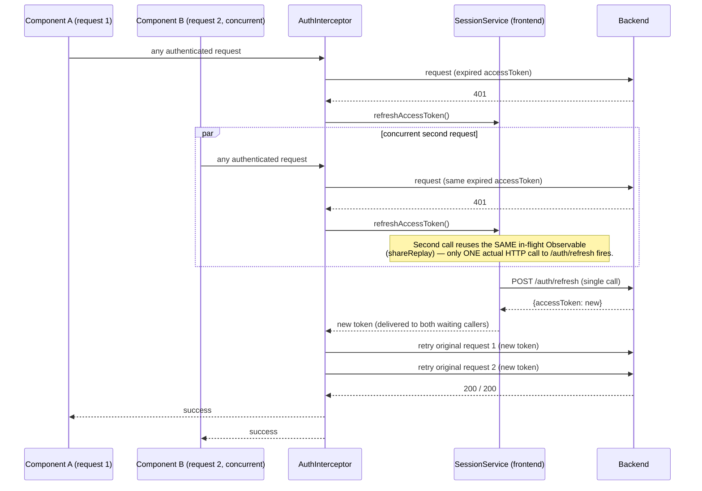

# AUTH_FLOW.md

## Core Authentication — Sequence Diagrams

Companion to docs/AUTHENTICATION.md — that document explains *why* each decision was made; this one shows *what happens, in order* for each flow. All diagrams reflect the as-built implementation (Milestone 2, Core Authentication sprint).

---

## 1. Register



No `TenantSettings`/`Subscription` rows are created — those tables don't exist until Milestone 3/8 (ADR-002, ADR-003).

---

## 2. Login



---

## 3. Refresh (Rotation — Happy Path)



---

## 4. Refresh Reuse Detection (Token Theft Response)



---

## 5. Logout (Single Device) — and Why It Does *Not* Trigger Reuse Detection

```mermaid
sequenceDiagram
    participant U as Browser
    participant A as AuthController
    participant Sess as SessionService
    participant DB as Postgres

    U->>A: POST /auth/logout (Authorization: Bearer <accessToken>, Cookie: refresh_token=<raw>)
    A->>Sess: revoke(rawToken)
    Sess->>DB: findByHash(HMAC(rawToken))
    DB-->>Sess: RefreshToken row (active)
    Sess->>DB: UPDATE RefreshToken SET revokedAt = now() (replacedBySessionId left NULL)
    Sess-->>A: done
    A-->>U: 200 {message: "Logged out."} + Set-Cookie refresh_token=; Max-Age=0 (cleared)

    Note over U,DB: If this SAME cookie is replayed later (e.g. a stale tab),<br/>rotate() finds revokedAt SET but replacedBySessionId NULL —<br/>classified as plain INVALID_OR_EXPIRED_REFRESH_TOKEN,<br/>NOT reuse. Other active sessions for this user are untouched.<br/>This is the fix verified by test/integration/auth/logout.integration-spec.ts.
```

---

## 6. Frontend Silent Refresh on App Bootstrap



---

## 7. Frontend 401 Interceptor (Mid-Session Token Expiry)


